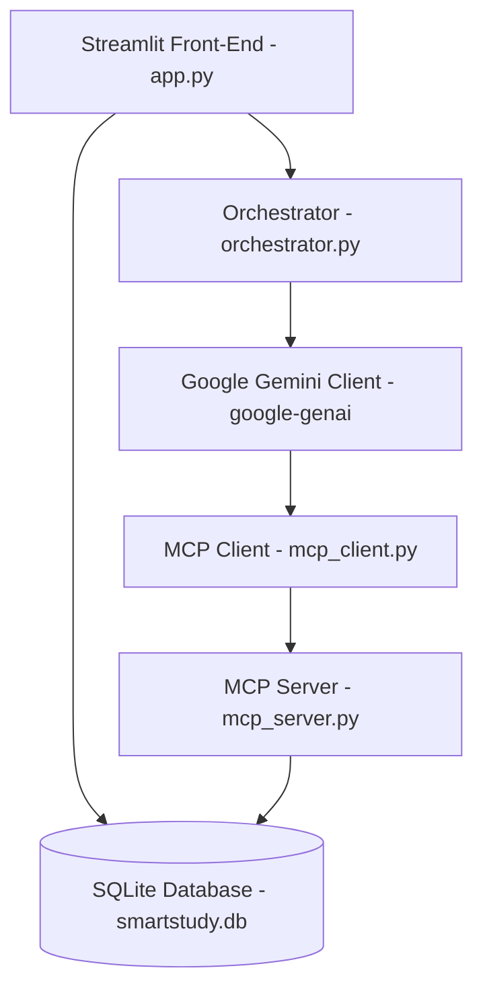

# SmartStudy AI

SmartStudy AI is a state-of-the-art multi-agent study planner and productivity ecosystem powered by the official **Google Gemini SDK (`google-genai`)** and structured around the **Model Context Protocol (MCP)**. It serves as a unified digital space to streamline academic planning, schedule optimization, revision tracking, doubt resolution, and progress tracking for students.

---

## Project Overview

Managing study schedules, revision intervals (like Spaced Repetition), and tracking streaks can be overwhelming. SmartStudy AI coordinates multiple AI specialized agents that collaborate to evaluate a student's academic goals, identify subject gaps, and build dynamic study schedules. It integrates memory structures (SQLite database) and background systems to ensure that generated schedules persist and update seamlessly.

---

## Features

- **Personalized Academic Profiles**: Define study hours, weak subjects, and target exam dates.
- **AI Study Strategy & Needs Analysis**: Formulate comprehensive learning paths and weekly milestones.
- **Dynamic Weekly Study Timetable**: Automated subject scheduling with color highlights for weak subjects, break sessions, and assignments. Also supports manual study session creation.
- **Task & Checklist Management**: Create, log, edit, and complete tasks organized by status.
- **Spaced Repetition Spacing (Revision Agent)**: Automatically map optimal review dates (1-day, 3-day, 7-day intervals) and set reminders.
- **Interactive Doubt Solver**: Solve complex topics in simple language with the ability to directly save study notes on the dashboard.
- **Progress Scorecards & Streak Tracker**: Track consistency streaks and logged study hours.
- **Motivation Boosters**: Generate focus quotes and productivity hacks.

---

## Tech Stack

- **Core**: Python 3.12+
- **Front-End (UI)**: Streamlit
- **Database / Storage**: SQLite
- **Model / Orchestrator**: Google Gemini 2.5 Flash via `google-genai` SDK
- **Integration Layer**: Model Context Protocol (MCP / FastMCP)
- **Data Visualizations**: Plotly, Pandas

---

## Project Architecture

SmartStudy AI uses a decoupled design where agents speak to local SQLite resources through a Model Context Protocol (MCP) server. 



---

## Folder Structure

```text
capstone/
├── app.py                     # Streamlit Main Application (Entry Point)
├── requirements.txt           # Production Package Dependencies
├── .env.example               # Example Configuration file
├── .gitignore                 # Git Ignored Files
├── src/
│   ├── database.py            # SQLite Schemas, CRUD helper functions
│   ├── mcp_client.py          # Synchronous MCP client wrapper
│   ├── mcp_server.py          # FastMCP Tool implementations
│   └── agents/
│       ├── __init__.py        # Package Init
│       ├── orchestrator.py    # Synchronous Google Gemini Agent runner & wrapper tools
│       ├── study_analysis_agent.py
│       ├── timetable_agent.py
│       ├── revision_agent.py
│       ├── progress_tracking_agent.py
│       ├── motivation_agent.py
│       └── doubt_solver_agent.py
└── tests/
    ├── test_agents.py         # Agent validation suite
    ├── test_db.py             # Database CRUD unit tests
    └── test_mcp.py            # MCP Client-Server integration tests
```

---

## Installation Guide

### Prerequisites
- Python 3.12 or higher installed.
- Git CLI configured.

### Steps
1. **Clone the Repository**:
   ```bash
   git clone https://github.com/nandinichenagoni183/SmartStudy-AI.git
   cd SmartStudy-AI
   ```

2. **Create and Activate Virtual Environment**:
   ```bash
   python -m venv venv
   # On Windows (cmd/powershell):
   .\venv\Scripts\activate
   # On macOS/Linux:
   source venv/bin/activate
   ```

3. **Install Dependencies**:
   ```bash
   pip install -r requirements.txt
   ```

---

## Environment Variables (.env)

Create a `.env` file in the root directory (based on `.env.example`):
```ini
GEMINI_API_KEY=your_gemini_api_key_here
```

---

## How to Run Locally

1. **Verify Local Setup**:
   Ensure database is initialized and seeded by running the unit tests:
   ```bash
   python tests/test_db.py
   python tests/test_mcp.py
   python tests/test_agents.py
   ```

2. **Launch App**:
   ```bash
   streamlit run app.py
   ```

---

## How to Deploy on Streamlit Community Cloud

1. Commit and push the project code to your public GitHub repository (`SmartStudy-AI`).
2. Visit [Streamlit Community Cloud](https://share.streamlit.io/) and click **New app**.
3. Select your repository, branch (`main`), and path to the entry point file (`app.py`).
4. Expand **Advanced settings...** and add your secrets to the **Secrets** section:
   ```toml
   GEMINI_API_KEY = "your_actual_gemini_api_key"
   ```
5. Click **Deploy!**. Streamlit will provision the container, install packages from `requirements.txt`, and run the app.

---

## Screenshots

*(Placeholder sections - Add images of the beautiful Dashboard, Weekly Timetable, Task Checklist, and AI Spaced Repetition Planner here!)*

---

## Future Enhancements

- **Dynamic Spacing Adaptation**: Auto-adjust spacing intervals based on quiz scoring.
- **Voice Doubt Solving**: Integration of voice synthesis to dictate doubt summaries.
- **Integrations**: Sync calendar events directly with Google Calendar API.

---

## License

This project is licensed under the MIT License. See [LICENSE](LICENSE) for details.

---

## Author

**Chenagoni Nandini**
- GitHub: [nandinichenagoni183](https://github.com/nandinichenagoni183)
